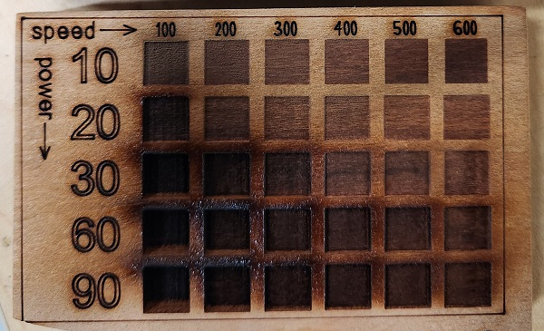
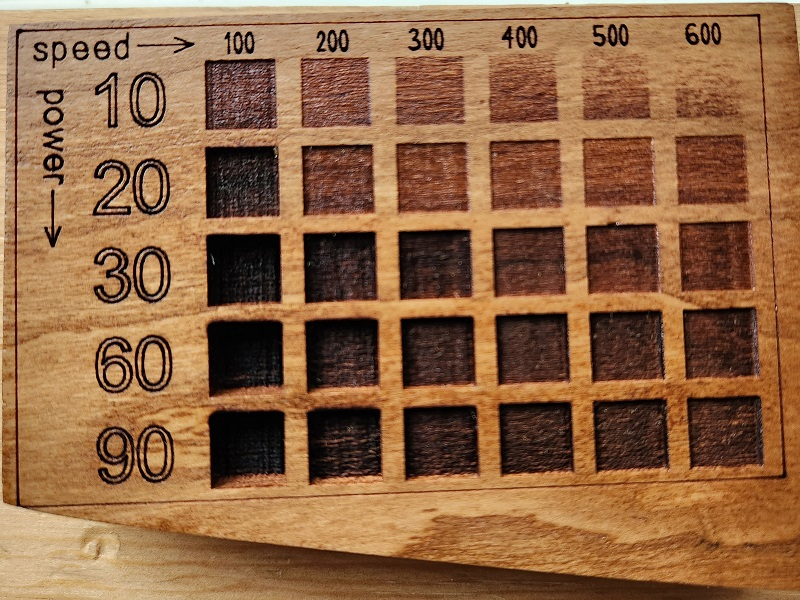
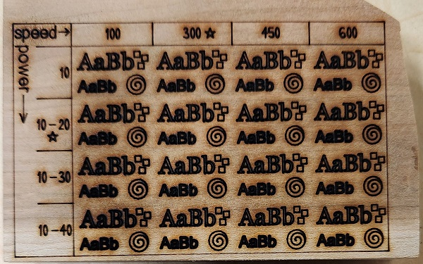
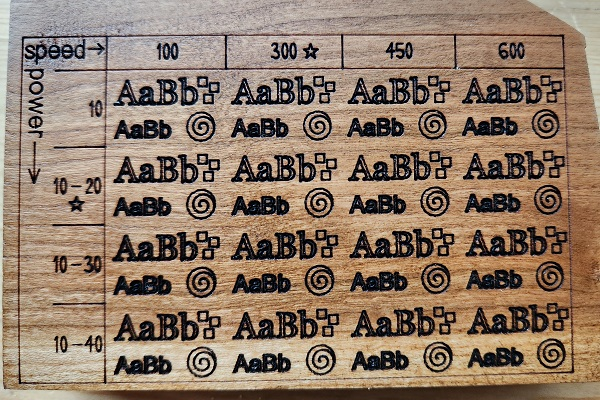

# Laser Engraving Tests
Designs for testing engraving power and speed settings on a laser cutter

## Software Versions
- The SVG files were created with Inkscape 1.3 (0e150ed6c4, 2023-07-21)
- The DXF files were exported from Inkscape 1.3 (0e150ed6c4, 2023-07-21) as AutoCAD DXF R14 with "ROBO-MASTER compatible" and "Use LWPOLYLINE" disabled
- The RLD files were created with RDWorks 8.01.26

## Tests
Both test designs fit in a 4" (101.6 mm) wide by 2&frac12;" (63.5 mm) tall rectangle. They are tables with the same repeated pattern engraved at different speeds and powers. The power axis is vertical, starting at the top left, and increasing as it moves downward. The speed axis is horizontal, starting at the top left, and increasing as it moves to the right.

### Lines

The Lines design has four speeds (100, 300, 450, and 600 mm/s) and four power levels (10%, 10-20%, 10-30%, and 10-40%) for a total of sixteen combinations. Each combination is used to engrave:
- The text "AaBb" in 18 point Georgia
- The text "AaBb" in 12 point Arial
- Outlines of three squares measuring 1/16" (about 1.59 mm) per side
- A circular spiral a little less than &frac14;" (6.4 mm) wide

There is a five pointed star by the labels for the 10-20% power row and the 300 mm/s speed column indicating that those settings are used to cut the axis labels, dividing lines, and frame for the test.

### Grid

The Grid design is a grid of thirty squares measuring &frac38;" (9.525 mm) per side, spaced &frac18;" (3.175 mm) apart, representing speeds of 100, 200, 300, 400, 500, and 600 mm/s and power levels of 10, 20, 30, 60, and 90%. The filled squares are "scan" or "engrave" regions and the stroked lines, text, and numbers are cuts. Like the Lines design, the labels and frame are cut at 10-20% power at 300 mm/s.

There are three RLD files for the Grid because RDWorks limits the number of different settings that can be used in one file. Each file engraves a different portion of the design:
- The frame and the axis labels: `grid_labels.rld`
- The 100, 200, and 300 mm/s columns: `grid_left.rld`
- The 400, 500, and 600 mm/s columns: `grid_right.rld`

The three files should be cut one after another without moving the workpiece.

## Results

Photographs of the test designs cut on various kinds of wood. Each image is a link to a higher resolution version.

### Cherry Wood, 130 Watt Laser

> [!NOTE]
> This piece was engraved using an older version of the DXF and RLD files that caused issues in RDWorks. I re-exported the DXF files and recreated the RLD files to match the power and speed settings. While the previews in RDWorks look correct, I haven't tested the new files on the laser cutter.

The wood was sanded with 80 grit sandpaper before engraving. After engraving, the charred residue was wiped off with ethanol and a cotton cloth. The wood was then sanded with 80, 120, and 220 grit sandpaper, and sealed with polyurethane spray.

|  |
| - |
| Photo of grid design immediately after engraving |

|  |
| - |
| Photo of grid design after cleaning, sanding, and finishing |

|  |
| - |
| Photo of lines design immediately after engraving |

|  |
| - |
| Photo of lines design after cleaning, sanding, and finishing |
